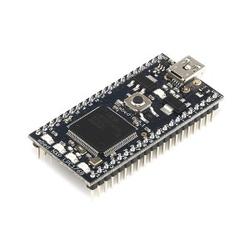

# Red Hat/ARM IoT BOF/Hackfest
 |  | 

Summary: A collection of projects that interfaces with the
[Sensinode Developer](https://silver.arm.com/browse/SEN00) NanoService 1.11 Developer
Release to expose the sensors of [mbed LPC1768](https://mbed.org/platforms/mbed-LPC1768/) +
[mbed Application Board](https://mbed.org/components/mbed-Application-Board/) combination
as POJOs in the JBoss Wildfly server.

### mbed LPC1768

### mbed Application Board

# Introduction
---------------------

This project includes EE7 component projects that illustrate connecting to the ARM NSP server to expose the sensor information as POJOs.

* iotbof-ear : The EE7 EAR containing the project EJB, WAR
* iotbof-ejb : An EE7 singleton EJB that connects to the NSP
* iotbof-rest : A wrapper api that communicates with the NSP endpoints using REST
* iotbof-test : Tests for the project elements
* iotbof-web : A web application that receives push notifications of sensor information
as well as simple web pages for viewing the sensor data.

## Requirements
You will need a Java SE 7 JDK instllation, and Maven 3+ in order to build and run the project. We don't specify how to install these here, but if you do need them, see:

* [Java SE Downloads](http://www.oracle.com/technetwork/java/javase/downloads/index.html)
  * [Current release, 7u51](http://www.oracle.com/technetwork/java/javase/downloads/jdk7-downloads-1880260.html)
* [Maven Downloads](http://maven.apache.org/download.cgi)
  * [Current release, Maven 3.2.1](http://mirrors.gigenet.com/apache/maven/maven-3/3.2.1/binaries/apache-maven-3.2.1-bin.tar.gz)

# Wildfly Setup
-------------------
We need the JBoss Java EE7 server implementation for this BOF. Here we describe how to download and configure the server.

* Download the EE7 release of Wildfly from [8.0.0.Final Download](http://download.jboss.org/wildfly/8.0.0.Final/wildfly-8.0.0.Final.zip)
* Unzip the the release to create a wildfly-8.0.0.Final directory that will be referred to as JBOSS_HOME

## Wildfly Configuration
There are a few @Resource injections from JNDI that need to be configured in the wildfly server configuration to specify the correct locations for the NSP server, it's domain, and the location of the iotbof-web project NspNotificationService. The configuration file that needs to be edited is $JBOSS_HOME/standalone/configuration/standalone.xml.

Pull this file into an editor, and search for the subsystem xmlns="urn:jboss:domain:naming:2.0" section. Add a bindings section as shown below:

    <subsystem xmlns="urn:jboss:domain:naming:2.0">
       <bindings>
          <simple name="java:global/NSPDomain" value="domain" type="java.lang.String"/>
          <simple name="java:global/NSPURL" value="http://red-hat-summit.cloudapp.net:8081/" type="java.net.URL"/>
          <simple name="java:global/NotificationCallbackURL" value="http://reponsehost:port/iotweb-war/events/send" type="java.net.URL"/>
       </bindings>
       <remote-naming/>
    </subsystem>

* The java:global/NSPDomain binding provides the domain name on the NSP server for the sensors.
* The java:global/NSPURL provides the base URL for the NSP REST interface
* The java:global/NotificationCallbackURL binding provides the URL for the NspNotificationService REST endpoint.

